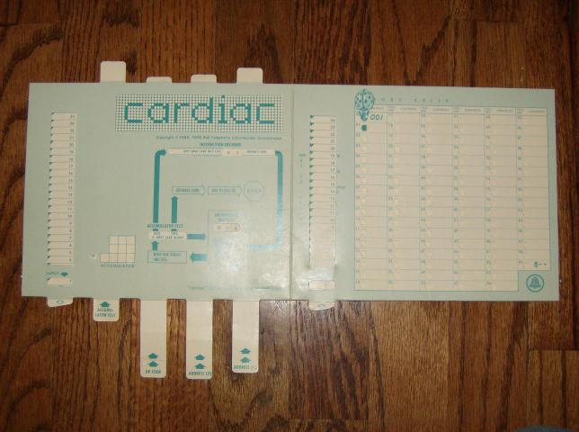
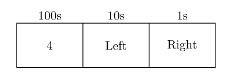

# cardiac_emulator
## Description

## Cardiac core

The acronym CARDIAC stands for "CARDboard Illustrative Aid to Computation." It was developed by David Hagelbarger at Bell Labs as a tool for teaching how computers work in a time when access to real computers was extremely limited. The CARDIAC kit consists of a folded cardboard "computer" and an instruction manual. In July 1969, the Bell Laboratories Record contained an article describing the system and the materials being made available to teachers for working with it.
As illustrated in the following pictures, the CARDIAC computer consisted of a left-hand CPU section and a right-hand memory section. On the CPU side there are five sliders:

* One slider of input "cards"
* One slider for the accumulator sign
* Three sliders for the digits of an instruction

The memory side has a single slider of output "cards." Portions of the sliders show through cutouts in the card frame. The cutouts for the input and output card sliders each show the current card to be read or written. The combination of the accumulator sign and the three instruction sliders show steps through cutouts that describe the operation of the selected instruction. Effectively, the sliders and cutouts are the instruction decoder of the CPU. Finally, each memory location has a hole in it. A small carboard ladybug serves as the program counter which is moved from location to location in response to the steps described on the CPU side.

The CARDIAC manual is 50+ pages divided into 16 sections describing the basics of computers from a late 1960s perspective. The first six sections cover things like flow charts, instructions, data, addresses, and the stored program concept. Sections 7–12 discuss the CARDIAC and some basic programming techniques including loops and multiplication. Sections 13 and 14 discuss the techniques for bootstrapping and subroutines, both of which we elaborate on below. Section 15 focuses on the development of a program to play NIM. Finally, Section 16 discusses assemblers and compilers. Although there is some duplication of information, the material on this page is not intended to replace the manual. Rather, the material here expands on that in the manual, particularly from the point of view of one who is already familiar with the most basic concepts of computers and programming.

## Cardiac architecture

### Memory

The CARDIAC has a grand total of 100 memory locations identified by the two-digit decimal numbers 00 through 99. Each memory location holds a signed three-digit decimal numer. (With the exception of a single code example, the CARDIAC book is actually silent on whether memory contains signed or unsigned values.) Locations 00 and 99 are special. Location 00 always contains the value 001, which as we see below is the instruction to read a card into location 01. This special value is used the the bootstrapping process discussed later. Location 99 always contains a value between 800 and 899. The tens and ones digits of the number are the value of the program counter after a jump instruction is executed. This provides the mechanism for a return from subroutine.
### CPU

The CARDIAC CPU is a single-accumulator single-address machine. Thus each instruction operates optionally on a single memory location and the accumulator. For example, the ADD instruction reads the data in one memory location, adds it to the current value of the accumulator and stores the result back into the accumulator. The ALU supports addition, subtraction, and decimal shifting. CARDIAC's CPU architecture is illustrated in the following figure: 

The CARDIAC accumulator holds a signed 4-digit number, which seems odd given that everything else is oriented around 3-digit numbers. The manual includes the statement:

Since CARDIAC's memory can store only 3-digit numbers, you may be puzzled by the inclusion of an extra square in the accumulator. It is there to handle the overflow that will result when two 3-digit numbers whose sum exceeds 999 are added. 

What's not clear is under what conditions that overflow/carry digit is kept or discarded. From the discussion of the SFT instruction in Section 12 of the manual, exactly four digits are kept for the intermediate value between the left and right shift operations. However, the manual doesn't state whether all four digits are kept between instructions nor what happens when storing the accumulator to memory if the accumulator contains a number whose magnitude is greater than 999. In the case of our simulator, we retain all four digits, effectively implementing a 4-digit ALU. However, when storing the accumulator to memory, we discard the fourth digit. I.e. the number stored in memory is a mod 1000, where a is the contents of the accumulator. 

### I/O

The CARDIAC has exactly one input device and one output device. These are a card reader and a card punch. Unlike real punch cards, the CARDIAC input and output cards can each hold exactly one signed three-digit number. When a card is read by way of the INP instruction, it is taken into the card reader and removed from the stack of cards to be read. Similarly, on each OUT instruction, a new card is "punched" with the specified value on it, and the card moved to the output card stack. 

## Instruction set
The CARDIAC's instuction set has only 10 instructions, each identified by an operation code (opcode) of 0 through 9. The instructions are as follows:

|Opcode                     |Mnemonic                    |Operation                     |
|---------------------------|---------------------------|---------------------------|
|0                     |INP                    |Read a card into memory                     |
|1                     |CLA                    |Clear accumulator and add from memory (load)                     |
|2                     |ADD                   |Add from memory to accumulator                     |
|3                    |TAC                   |Test accumulator and jump if negative                     |
|4                     |SFT                    |Shift accumulator                    |
|5                     |OUT                    |Write memory location to output card                    |
|6                     |STO                    |Store accumulator to memory                     |
|7                     |SUB                    |Subtract memory from accumulator                     |
|8                    |JMP                    |Jump and save PC                     |
|9                     |HRS                    |Halt and reset                    |

### Encoding
All instructions are non-negative numbers expressed as three-digit decimal numerals. The CARDIAC manual doesn't describe what happens if an attempt is made to execute a negative instruction. In our simulator, we treat negative instructions as no-ops (i.e. they are ignored and the program continues on to the next instruction). The operation code is the most significant of those three digits, i.e., o=⌊i /100⌋, where i is the contents of the instruction register (IR) loaded from the memory location specified by the PC. For most instructions, the lower-order digits are the address of the operand, i.e. a=i mod 100. This arrangement is illustrated in the following figure. 

In the cases of the INP and STO instructions, a is the destination address for the data coming from either an input card or the accumulator, respectively. In the cases of the CLA, ADD, OUT, and SUB instructions, a is the source address of the second operand to the ALU or the source address of the operand being written to an output card. For the TAC, JMP, and HRS instructions, a is the address to be loaded into the PC (conditionally, in the case of the TAC instruction). The remaining instruction, SFT, doesn't treat the lower-order digits as an address. Instead, each of the lower-order digits is a number of digit positions to shift first left, then right. The left shift count is given by l=⌊a /10⌋, and the right shift count is given by r=a mod 10. The instruction format for the SFT instruction is shown in the following figure: 

